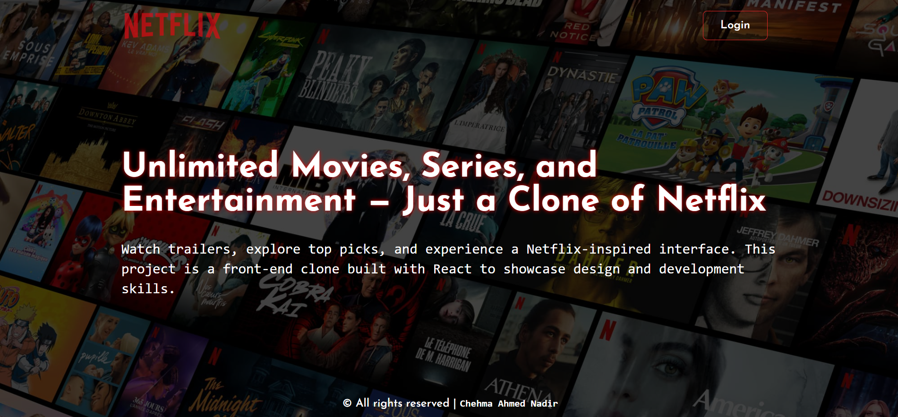
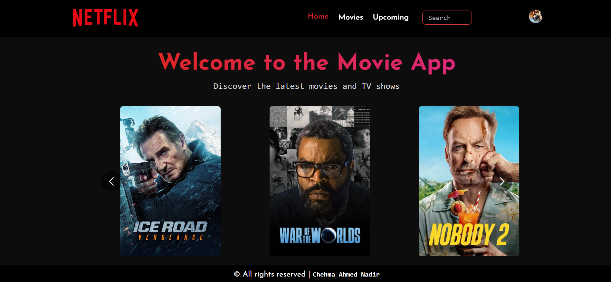
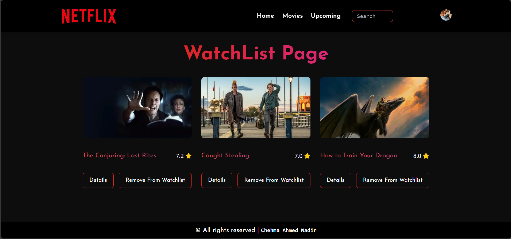

# 🎬 Netflix Clone

A **Netflix-inspired** web application built with **React.js**, **Tailwind CSS**, and Vite, featuring user authentication powered by Clerk and real-time movie data from TMDB API.

---
## Login Page


---
## Home Page


---
## Watchlist Page


---

## 🚀 Live Demo
🔗 [View Website](https://myfilms-app.netlify.app/)

---

## ✨ Features
- 🔐 **User Authentication** (Sign up / Sign in / Sign out) using [Clerk](https://clerk.com).
- 🎥 **Browse Movies** fetched dynamically from the [TMDB API](https://developer.themoviedb.org/).
- 🔎 **Search Movies** — search films by name (instant search / query TMDB).
- 📄 **Movie Details** — detailed movie page showing overview, release date, rating, and images.
- ❤️ **Watchlist Management**
  - Add movies to your personal watchlist.
  - Remove movies from your watchlist.
  - Watchlist is stored per authenticated user (full control).
- ▶️ **Access Control** — user must be logged in to watch/select movies and manage the watchlist.
- 📱 **Responsive Design** using Tailwind CSS for mobile, tablet, and desktop.
- ⚡ **Fast Development & Build** powered by Vite.
---

## 🛠️ Tech Stack
- **Frontend :** [React.js](https://react.dev/) + [Tailwind CSS](https://tailwindcss.com/) 
- **Authentication:** [Clerk](https://clerk.com/)
- **Movie Data API:** [TMDB (The Movie Database)](https://developer.themoviedb.org/)
- **Hosting & Deployment:** [Netlify](https://www.netlify.com/) 
- **Version Control:** [Git](https://git-scm.com/) + [GitHub](https://github.com/)
- **Build Tool:** [Vite](https://vitejs.dev/)


---


## ⚡ Installation & Setup
Run the project locally:

```bash
# Clone the repository
git clone https://github.com/Naadix/Netflix-Clone.git

# Navigate into the project folder
cd Netflix-Clone

# Install dependencies
npm install

# Start the development server
npm run dev
